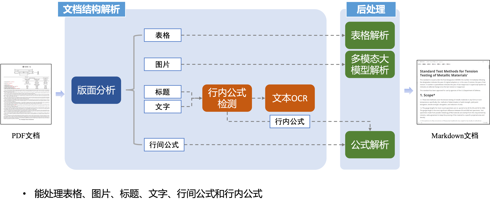

<div id="top"></div>
<div align="center">

[](https://github.com/jaychempan/llm-pdf-parsing)
[](https://github.com/jaychempan/llm-pdf-parsing)
[](https://github.com/jaychempan/llm-pdf-parsing/tree/main/LICENSE)
[](https://github.com/jaychempan/llm-pdf-parsing/issues)
[](https://github.com/jaychempan/llm-pdf-parsing/issues)

[English](README.md) | [简体中文](README_zh-CN.md)

</div>

# 大模型PDF文档解析
## 项目简介

主要针对LLM领域数据中的pdf解析，完成对批量PDF转换成LLM训练数据。首先进行版面识别得到结构化的json输出，然后对一些难处理的公式、图片和表格等进行后处理更新结构化的json，最终组装成markdown文件。

llm-pdf-parsing的框架:



## 环境安装

部分环境安装可以参考[PaddleOCR 安装指南](https://github.com/PaddlePaddle/PaddleOCR/blob/release/2.6/ppstructure/recovery/README_ch.md#2)或者按照下面的安装指南进行安装：

```
conda create --name llmpro python=3.9
conda activate llmpro
python3 -m pip install "paddlepaddle-gpu" -i https://mirror.baidu.com/pypi/simple
cd llm-pdf-parsing/PaddleOCR
python3 -m pip install -r ppstructure/recovery/requirements.txt
# 安装 paddleocr，推荐使用2.6版本
pip3 install "paddleocr>=2.6"

# markdown转换需要
pip install markdownify

# 公式支持
pip install --upgrade unimernet
pip install transformers==4.40.0 # 需要确保transformers版本号
sudo apt-get install libmagickwand-dev

# 书生多模态支持，参考（可以单独安装一个新环境）
https://github.com/OpenGVLab/InternVL/blob/main/INSTALLATION.md
注意这里的transformer版本
pip install transformers==4.33.0
```
## 目录结构
以下是`llm-pdf-parsing`项目的目录结构说明
```
.
├── assets
├── data # 存放数据
├── LICENSE
├── logs # 存放处理日志
├── paddleocr  # PaddleOCR的主目录，里面包括各种函数，包括训练模型等
├── pipline  # 处理pdf的主要程序目录
│   ├── clean-jsonl.py
│   ├── json2markdown.py
│   ├── markdown2jsonl.py
│   ├── pdf-structure-mgpu.py
│   ├── pdf-structure.py
│   ├── pos-process-figure-mgpu.py
│   ├── pos-process-mgpu.py
│   ├── pos-process.py
│   ├── pos-process-single-cnocr.py
│   ├── pos-process-single.py
│   ├── pos-process-table-mgpu.py
│   └── update-ppstru-json.py
├── README.md
├── tools # 存放好用的工具函数
└── weights # 存放模型权重
    ├── pix2text-mfr
    ├── ppocr_weights
    ├── readme.txt
    └── unimernet
```

## 使用方法

打开`pipline`文件目录,按照下面步骤顺序进行处理：

1.执行`pdf-structure.py`解析出pdf的结构，生成结构化的json文件

```
python pdf-structure.py

# 多卡多进程版本（充分利用显卡资源的方式）
python pdf-structure-mgpu.py --input_directory ./data/input/ --output_directory ./data/output/ --num_processes 2
```
修改`args`参数列表即可
```
args = {
    '--image_dir': '../demo/demo.pdf',
    '--det_model_dir': '../weights/ppocr_weights/det/ch/ch_PP-OCRv4_det_infer', 
    '--rec_model_dir': '../weights/ppocr_weights/rec/ch/ch_PP-OCRv4_rec_infer',
    '--rec_char_dict_path': '../paddleocr/ppocr/utils/ppocr_keys_v1.txt',
    '--table_model_dir': '../weights/ppocr_weights/table/ch_ppstructure_mobile_v2.0_SLANet_infer',
    '--table_char_dict_path': '../paddleocr/ppocr/utils/dict/table_structure_dict_ch.txt',
    '--layout_model_dir': '../weights/ppocr_weights/layout/picodet_lcnet_x1_0_fgd_layout_cdla_infer',
    '--layout_dict_path': '../paddleocr/ppocr/utils/dict/layout_dict/layout_cdla_dict.txt',
    '--recovery': 'True',
    '--output': '../data/demo/',
    '--use_pdf2docx_api': 'False',
    '--mode': 'structure',
    '--return_word_box': 'False',
    '--use_gpu': 'True'
}
```
或者直接运行下面命令
```
python ../paddleocr/ppstructure/predict_system.py --image_dir /path/to/pdf/ --det_model_dir ./weights/ppocr_weights/det/ch/ch_PP-OCRv4_det_infer --rec_model_dir ./weights/ppocr_weights/rec/ch/ch_PP-OCRv4_rec_infer --rec_char_dict_path ./PaddleOCR/ppocr/utils/ppocr_keys_v1.txt --table_model_dir ./weights/ppocr_weights/table/ch_ppstructure_mobile_v2.0_SLANet_infer --table_char_dict_path ./PaddleOCR/ppocr/utils/dict/table_structure_dict_ch.txt --layout_model_dir ./weights/ppocr_weights/layout/picodet_lcnet_x1_0_fgd_layout_cdla_infer --layout_dict_path ./PaddleOCR/ppocr/utils/dict/layout_dict/layout_cdla_dict.txt --recovery True --output /path/to/out/ --use_pdf2docx_api False --mode structure --return_word_box False --use_gpu True
```

2.执行`pos-process.py`对公式，图像，表格进行后处理，更新前一步骤生成的json文件（处理指定目录下的所有子目录中的json文件）
```
python pos-process.py --input_directory /path/to/out/structure

# 多卡多进程版本，会多次调用pos-process-single函数(处理指定目录下的json文件)
python pos-process-mgpu.py --input_directory ../data/output/structure --config_path ./weights/unimernet/demo.yaml --num_processes 2
```

3.执行`json2markdown.py`将json文件转换成markdown格式

```
python json2markdown.py --input_directory ../data/output/structure
```

4.执行`markdown2jsonl.py`将markdown转换成jsonl格式
```
python markdown2jsonl.py --input_directory ../data/output/structure
```

5.（可选）使用大模型处理表格(使用书生多模态为例)
大模型处理图片
```
python pos-process-figure-mgpu.py --input_directory ../data/output/structure --process figures[tables,both]
python pos-process-table-mgpu.py --input_directory ../data/output/structure --process figures[tables,both]
```
更新结构化的json文件
```
python update-ppstru-json.py --input_directory ../data/output/structure
```
继续执行上述3和4步骤即可获得最终的训练格式

6.基于jsonl的数据清洗，可进行数据脱敏和正则化删除异常值
```
python clean-jsonl.py --input_file /path/to/jsonl --delete_strs "key1" "key2"
```

## 不同的json文件

1.结构化json文件(以_ocr为结尾的json格式)

<details>
  <summary>展开看具体json格式数据结构</summary>

```
=# 主要针对pdf进行解析
pdf_info = {
    "pdf_info": [page_info1, page_info2, ...],
    "_parse_type": "ocr"
}
=# 每个页面中获取的信息
page_info = {
        "preproc_blocks": [], # 也是按照顺序（包含所有需要的要素）
        "page_idx": page_idx, # 需要更新
        "images": [], # 图像包括图像标题放这里
        "tables": [], # 表格包括表格标题放这里
        "interline_equations": [], # 行间公式放在这里
        "discarded_blocks": [], # 需要丢弃的放这里
        "para_blocks": [] # 按照段落顺序，可以放置preproc_blocks后处理格式
    }
################图像和图像标题处理###############################
=# images 结构解析(三级结构)
{
    "type": "image",
    "bbox": [],
    "blocks": [] # 其中包含了image_body 和 image_caption
}

=## image_body 和 image_caption具体结构都为
{
    "bbox": [],
    "type": "image_body", # or "image_caption"
    "lines": []
}

=### lines内包含
=#### image_body
{
    "bbox": [],
    "spans": [
        {
            "bbox": [],
            "type": "image",
            "image_path": "XXX.jpg"
        }
    ]
}
=#### image_caption
{
    "bbox": [],
    "spans": [
        {
            "bbox": [],
            "content": "XXXX",
            "type": "inline_equation" # or "text"
        }
    ]
}

################表格和表格标题处理###############################
（同上格式）

################文本和文本标题处理###############################
=# text/title
{
    "type": "text", # or "title"
    "bbox": [],
    "lines": [] # 其中包含了image_body 和 image_caption
}

lines 内部包含：
{
    "bbox": [],
    "spans": [
        {
            "bbox": [],
            "content": "XXX",
            "type": "inline_equation" # or "text"
        }
    ]
}
################公式处理###############################
=# interline_equations
=## 
{
    "type": "interline_equation", 
    "bbox": [],
    "lines": [] # 其中包含了image_body 和 image_caption
}

lines 内部包含：
{
    "bbox": [],
    "spans": [
        {
            "bbox": [],
            "content": "XXX",
            "type": "interline_equation" $ 是转换成latex格式的，所以需要进行后处理
        }
    ]
}

```

</details>

2.大模型训练jsonl格式（每个markdown为jsonl文件的一条元数据）：

```
{
    "id": "BkORdv3xK7IA0HG7pccr",
    "content": "\\*诗作[222]\n录自索菲娅·马克思的笔记本\n#### 人生\n时光倏忽即逝，\n宛如滔滔流水；\n时光带走的一切，\n永远都不会返回。\n生就是死，\n生就是不断死亡的过程；\n人们奋斗不息，\n却难以摆脱困顿；\n人走完生命的路，\n最后化为乌有；\n他的事业和追求\n湮没于时光的潮流。\n对于人的事业，\n精灵们投以嘲讽的目光；\n因为人的渴望是那样强烈，\n而人生道路是那样狭窄迷茫；\n人在沾沾自喜之后，\n便感到无穷的懊丧；\n那绵绵不尽的悔恨\n深藏在自己的心房；\n人贪婪追求的目标\n其实十分渺小；\n人生内容局限于此，\n那便是空虚的游戏。\n有人自命不凡，\n其实并不伟大；\n这种人的命运，\n就是自我丑化。\n卡尔·马克思\n#### 查理大帝\n使一个高贵心灵深受感动的一切，\n使所有美好心灵欢欣鼓舞的一切，\n如今已蒙上漆黑的阴影，\n野蛮人的手亵渎了圣洁光明。\n巍巍格拉亚山的崇高诗人，\n曾满怀激情把那一切歌颂，\n激越的歌声使那一切永不磨灭，\n诗人自己也沉浸在幸福欢乐之中。\n高贵的狄摩西尼热情奔放，\n曾把那一切滔滔宣讲，\n面对人山人海的广场，\n演讲者大胆嘲讽高傲的菲力浦国王。\n那一切就是崇高和美，\n那一切笼罩着缪斯的神圣光辉，\n那一切使缪斯的子孙激动陶醉，\n如今却被野蛮人无情地摧毁。\n这时查理大帝挥动崇高魔杖，\n呼唤缪斯重见天光；\n他使美离开了幽深的墓穴，\n他让一切艺术重放光芒。\n他改变陈规陋习，\n他发挥教育的神奇力量；\n民众得以安居乐业，\n因为可靠的法律成了安全的保障。\n他进行过多次战争，\n杀得尸横遍野血染疆场；\n他雄才大略英勇顽强，\n但辉煌的胜利中也隐含祸殃；\n他为善良的人类赢得美丽花冠，\n这花冠比一切战功都更有分量；\n他战胜了那个时代的蒙昧，\n这就是他获得的崇高奖赏。\n在无穷无尽的世界历史上，\n他将永远不会被人遗忘，\n历史将为他编织一顶桂冠，\n这桂冠决不会淹没于时代的激浪。\n卡尔·马克思于1833年\n#### 莱茵河女神\n**叙事诗**\n(见本卷第885—889页)\n#### 盲女\n**叙事诗**\n(见本卷第852—858页)\n#### 两重天\n**乘马车赴柏林途中**\n(见本卷第475—478页)\n#### 父亲诞辰献诗。1836年\n**(见本卷第845—846页)**\n#### 席勒\n**十四行诗两首**\n(见本卷第846—847页)\n#### 歌德\n**十四行诗两首**\n(见本卷第848—849页)\n#### 女儿\n**叙事诗**\n(见本卷第838—841页)\n#### 凄惨的女郎\n**叙事诗**\n(见本卷第533—537页)\n卡·马克思写于1833年一大约1837年\n第一次用原文发表于《马克思恩格斯全集》1975年历史考证版第1部分第1卷\n并用俄文发表于《马克思恩格斯全集》1975年莫斯科版第40卷\n原文是德文\n中文根据《马克思恩格斯全集》1975年历史考证版第1部分第1卷翻译\n---\n**注释：**\n[222]马克思的这些诗作是他的姐姐索菲娅抄录在一个笔记本里的。除了马克思的诗作外，笔记本里还有其他人的诗作以及索菲娅自己和她的亲友的个人记事。马克思的这些诗作，除了《人生》和《查理大帝》外都在马克思的几本诗集和索菲娅的纪念册里出现过。《查理大帝》一诗注明写作日期是1833年，可见马克思早在中学时代就已开始写诗了。《盲女》注明写作日期是1835年。为祝贺父亲生日而献给亨利希·马克思的诗作的写作日期应该不晚于1836年初。——913。"
}
```


## 项目支持

- [UniMERNet](https://github.com/opendatalab/UniMERNet): A Universal Network for Real-World Mathematical Expression Recognition

- [PaddleOCR](https://github.com/PaddlePaddle/PaddleOCR/tree/main): Awesome multilingual OCR toolkits based on PaddlePaddle.

- [PPStructure](https://github.com/PaddlePaddle/PaddleOCR/blob/main/ppstructure/README_ch.md): An intelligent document analysis system.

- [InternVL](https://github.com/OpenGVLab/InternVL/tree/main): nternVL Family: A Pioneering Open-Source Alternative to GPT-4V.

- [CnSTD](https://github.com/breezedeus/CnSTD): CnSTD: 基于 PyTorch/MXNet 的 中文/英文 场景文字检测（Scene Text Detection）、数学公式检测（Mathematical Formula Detection, MFD）、篇章分析（Layout Analysis）的Python3 包

- [Miner-PDF-Benchmark](https://github.com/opendatalab/Miner-PDF-Benchmark/tree/main): MPB (Miner-PDF-Benchmark) is an end-to-end PDF document comprehension evaluation suite designed for large-scale model data scenarios.

- [MinerU](https://github.com/opendatalab/MinerU): MinerU is a one-stop, open-source data extraction tool，supports PDF/webpage/e-book extraction.

## 感谢