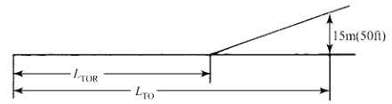
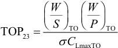
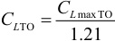
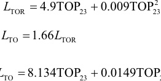
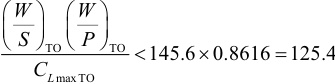

(2）按起飞距离要求 飞机的起飞距离取决于下列因素： a.起飞重量Wro; b.起飞速度Vro; c.起飞时的推力载荷（T/W）ro（或功率载荷（W/P）ro及相应的螺旋桨特性）; d.气动阻力系数CDG及地面摩擦因数μG; e.驾驶员技术。 本节中假定起飞是指硬面跑道上的起飞。起飞要求通常以场长表示，而场长的定义随飞 机类型不同而有很大不同。民用飞机中家制飞机无适航要求，可由设计者自定。其余则必须 满足23部或25部适航要求。以下所谈的均指带机械襟翼的飞机。 a.按23部起飞距离要求 23部的飞机通常为螺旋桨飞机，23部对起飞距离的定义见图3-7。 

图3-723部对起飞距离的定义

飞机的起飞滑跑距离LToR随起飞参数变化。23部飞机的起飞参数TOP23的量纲 是1b²/（f²·hp)，定义如下 
注意：离地升力系数CLro与最大升力系数CLmaxTo的关系如下 

按23部适航的一系列单发及双发飞机的LToR与起飞参数TOP23的相关图中统计数字有很 大的分散，原因一是起飞程序各有不同，二是起飞推力与螺旋桨效率密切相关，三是因为起 飞抬头的动作与抬头力矩、操纵感觉及飞机转动惯量有很大联系。但是在初步定参数阶段仍 可使用统计数据的回归拟合式。两个经验公式如下 
由此可得到 

当设计要求规定了所设计的飞机在指定高度的标准大气下的LroR 及Lro 之后，由于 Lro及LToR本身是相关的，可以算出哪一个要求最临界。然后可解出TOP23的值。假定求 出的值为145.61b²／(f²·hp)，并假定指定的Lro高度为5000ft，该高度o=0.8616这样得到 
据此可列出所需(W/P)ro值，如下表所示。 

